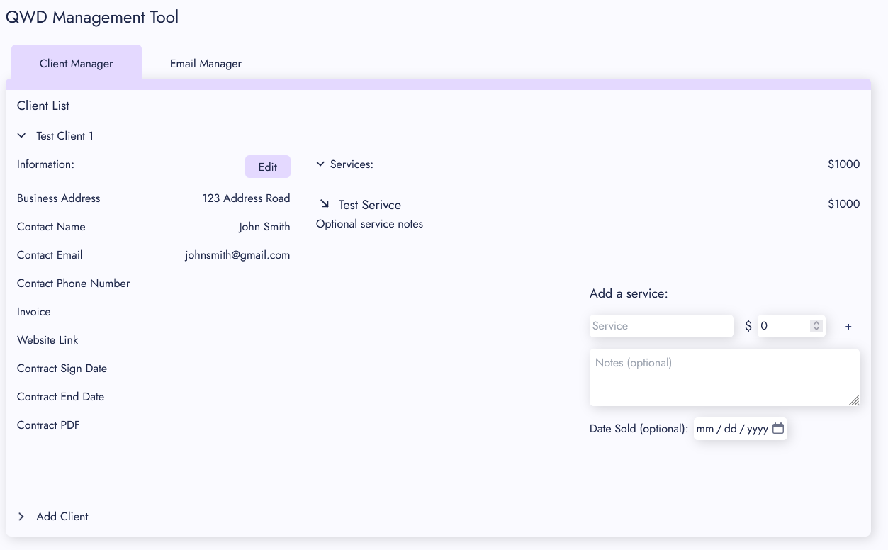
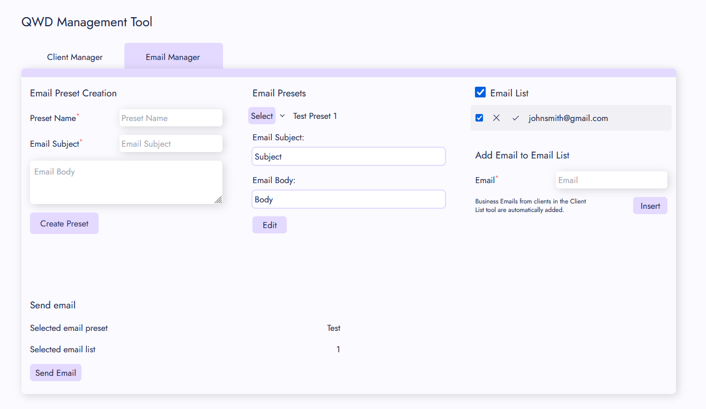

# Automated Email and Client Management Tool

Built to help businesses manage their clients and send automated email promotions to their entire email list with the click of a button.

Able to be drag and dropped into any react project with the proper dependencies installed.

Utilizes Firebase for authentication and database management.

Version 1.0.0

## Features

- Client manager with much of the necessary info for a business to keep track of their clients
- Automated email tool that allows a business to send out a promotion to their entire email list with the click of a button
- Ability to add, edit, and delete clients and their services
- Ability to add, edit, and delete email presets
- Ability to add and delete emails to email list

## Dependencies

- React
- TailwindCSS
- EmailJS
- React-Router
- Firebase
- React-Spinners
- React-Tippy

## TODOs:

- Migrate to TypeScript
- Update state management to use Redux
- Better handling of errors
- Updated UI/UX
- Add export to excel functionality
- Add automated invoice generation
